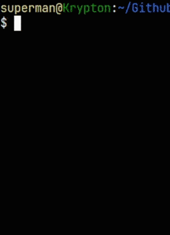
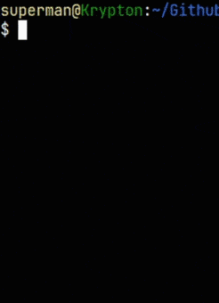
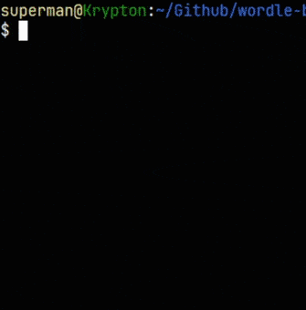

# Wordle.bash

|  |  |  |
| --- | --- | --- |

A pure bash Wordle clone.

## How to play

Run:
```bash
git clone https://github.com/MavikBow/wordle-bash.git
cd wordle-bash
./wordle.bash
```

## Help menu:
```txt
./wordle.bash --help
wordle.bash - a clone of a browser game Wordle by NYT

Usage: ./wordle.bash [OPTION...]

 -h, -?, help, --help           Prints this help menu.
 -hm, -H, hard, --hard          Plays in hard mode, meaning any revealed hints must be used in subsequent guesses.
 -d, date, --date YYYY/MM/DD    Plays a specific day. Note, you can't go earlier than 2021/06/19.
                                today, yesterday and tomorrow can be used instead of YY/MM/DD.
 -r, random, --random           Plays a random word from the answer list.
 -q, quiet, --quiet	        Stops the answer from showing upon losing.

In-game commands:

 :q, :quit, :exit, quit, exit   Quits the game.

Source code for this is available at <https://github.com/MavikBow/wordle-bash/>
```
